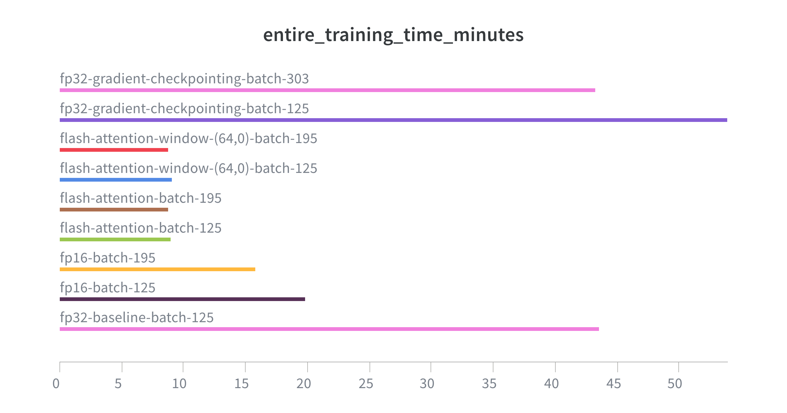
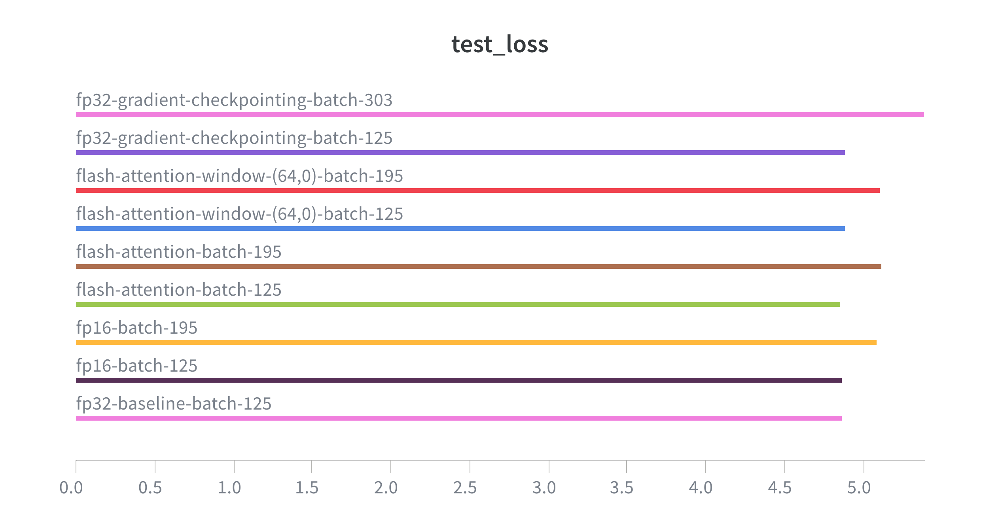

# Memory-Efficient Transformer Training Techniques

## Introduction
The objective of this exercise was to compare different memory-efficient techniques that can be used for training transformer models, including:

- FP32 (Baseline)

- FP16

- FlashAttention

- Windowed (local) attention

- Gradient checkpointing

Tests were performed on a GPT-2-like decoder-only architecture with the plwiki dataset

## Runtime Hardware
All tests were executed on RunPod resources with an A40 (48 GB VRAM). 

## Dataset
The dataset used was `plwiki`, retrieved via [speakleash](https://github.com/speakleash/speakleash). The entire dataset was not used; instead, 100k high-quality documents were selected. It was split into train, val, and test datasets with proportions 80/10/10.

## Tokenizer 
 Tokenizer was taken from [speakleash/Bielik-4.5B-v3](https://huggingface.co/speakleash/Bielik-4.5B-v3) which actually was `LlamaTokenizerFast` and was used via the `AutoTokenizer` class from the `transformers` library. The vocabulary size was `32000`.

## Model architecture
The Transformer architecture was a decoder-only model based on the GPT-2 implementation with 134,367,744 parameters.
The model has a 256 context length with an embedding dimension of 768. There were
12 transformer blocks with 12 heads of multi-head self-attention in each block with layer normalization and residual connections. Each head of attention has a size of `768 / 12 = 64`.
For positional encoding, an `nn.Embedding` layer was used to learn this representation, not a sine/cosine-based positional encoding like in [Attention Is All You Need](https://arxiv.org/abs/1706.03762).

Model summary can be found in [outputs/model_summary.txt](outputs/model_summary.txt).

## Codebase
Most of the code was taken from previous exercises and adjusted for the current task. The most important parts are:
- [llm_train.py](llm_train.py): Training loop for custom GPT-2 implementation based on PyTorch
- [transformer_based_llm.py](transformer_based_llm.py): Code for creating GPT-2 like architecture including adjustments for this laboratory (flash-attention, gradient checkpointing)
- [dataset.py](dataset.py): Code for creating dataloaders based on Speakleash/Hugging Face datasets
- [utils.py](utils.py): Common utilities useful for training, e.g., calculating loss
- [memory_tracker.py](memory_tracker.py): Custom memory tracker to track memory utilization across different parts of the program

Example of usage:
```bash
python llm_train.py --model_type transformer --tokenizer speakleash/Bielik-4.5B-v3 --dataset_name plwiki --tokenizer_type transformers --max_training_minutes 120 --adjust_batch_size true --use_flash_attention false --use_gradient_checkpointing true --use_fp16 false
```

Some test configurations can be set up via script flags like:
- `--adjust_batch_size`: Flag for adjusting batch size to the maximum batch size that fits into memory
- `--use_flash_attention`: Flag for using flash attention
- `--use_gradient_checkpointing`: Flag for using gradient checkpointing
- `--use_fp16`: Flag for using BF16 Automatic Mixed Precision

Other interesting parameters like `batch_size` or `Attention Window Size` have to be change manually directly in the `llm_train.py` file.

Installation of flash-attention was pretty straightforward in my case. I set up the environment on Runpod based on my [pyproject.toml](pyproject.toml) file via:
```bash
uv venv --python 3.12
source .venv/bin/activate
uv sync
```
That gave me torch version `2.8.0+cu128` and CUDA version `Cuda compilation tools, release 12.8, V12.8.93`.
One more thing required for getting the proper wheels was the `cxx11abi` flag. Referring to this [issue](https://github.com/Dao-AILab/flash-attention/issues/457), it is a compilation configuration for PyTorch. I checked it on my setup with `python -c "import torch; print(torch.compiled_with_cxx11_abi())"`. That command returned `True`, so I had all the required information.
Having that information, I was looking for a fitting version of the wheels release on the original [flash-attention repository](https://github.com/Dao-AILab/flash-attention/releases). I found it and installed it via:
```bash
uv pip install https://github.com/Dao-AILab/flash-attention/releases/download/v2.8.3/flash_attn-2.8.3+cu12torch2.8cxx11abiTRUE-cp312-cp312-linux_x86_64.whl
```

With that, I was able to use flash-attention.

For memory profiling, I initially used the PyTorch memory profiler and followed this [tutorial](https://docs.pytorch.org/tutorials/recipes/recipes/profiler_recipe.html). I had a problem with that approach as I wanted to use the `record_function` functionality for tracking different parts of the training loop like `forward_pass`, `backward_pass`, and `entire_training_step`, but in my traces I had information about CPU/CUDA time but I didn't have information about memory. I used the scheduler:
```bash
from torch.profiler import schedule
my_schedule = schedule(skip_first=10, wait=5, warmup=1, active=3, repeat=2)
```
as it was recommended for long-run tasks like training loops. I spent some time on it but I couldn't figure out what was wrong with my approach, so I decided to use a custom memory tracker.

## Training
Training was performed with the `Adam` optimizer with a learning rate of 0.0005 and weight decay of 0.1. After each 100 steps, there was a calculation of loss and perplexity on training data for logging purposes. It was just one training batch to have some information about whether there were any issues with training. Actually, I didn't use a validation split from my dataset as this laboratory was focused on efficient techniques, so I didn't want to execute unnecessary calculations. After training ended, I calculated test metrics across the entire test split, which were the main metrics to compare.
The adjusted batch size technique started with the initial provided batch size (64) and was increased by 1/4 of the current batch size until an out-of-memory error was raised. All experiments were performed with one epoch.

## Results
Finally, I performed 9 different runs which will be compared in this section. I started with an FP32 baseline and checked the maximum batch size that fits into memory - that was 125. For each mentioned configuration (FP16, flash-attention, window attention, gradient checkpointing), I performed a run with a batch size of 125 and the maximum batch size that fitted into memory. I introduced the following run naming convention:
- fp32-baseline-batch-125
- fp16-batch-125
- fp16-batch-195
- flash-attention-batch-125
- flash-attention-batch-195
- flash-attention-window-(64,0)-batch-125
- flash-attention-window-(64,0)-batch-195
- fp32-gradient-checkpointing-batch-125
- fp32-gradient-checkpointing-batch-303

Batch size 125 is for comparison with the baseline max batch size, while different values were retrieved as the maximum batch size for each configuration.
I split the comparison into 3 sections: memory usage, execution time, and quality metrics to avoid presenting quite large tables.

### Memory Usage
Memory usage was tracked with my custom memory tracker and I measured maximum memory allocation for 3 training loop parts:
- Backward pass
- Forward pass
- Entire training step

| Configuration | Backward Pass [GB] | Forward Pass [GB] | Training Step [GB]|
|--------------|---------------|--------------|---------------|
| fp32-baseline-batch-125 | 32.4| 24.9 | 32.4|
| fp16-batch-125 |22.4 |15 | 22.4|
| fp16-batch-195 | 34| 22.4| 32|
| flash-attention-batch-125 | 21.9| 14.4|21.9 |
| flash-attention-batch-195 |33.2 | 21.5| 33.2|
| flash-attention-window-(64,0)-batch-125 |21.9 | 14.4|21.9 |
| flash-attention-window-(64,0)-batch-195 | 33.2|21.5 |33.2 |
| fp32-gradient-checkpointing-batch-125 |**14.2** | **6.7**| **14.2**|
| fp32-gradient-checkpointing-batch-303 |32.4 |14.1 | 32.4|

*Table 1: Comparison of memory usage for different configurations.*

The best memory savings I obtained were for gradient checkpointing mode, which decreased maximum memory for the training step from `32.4` GB in baseline to `14.2` GB. It also handled the largest maximum batch size of `303`, while other configurations handled `195`. For each configuration, the forward pass took less memory than the backward pass, and the backward pass took maximum memory during the training step. Suspicious is the windowed attention part. I obtained almost the same results for normal flash-attention and windowed flash-attention. I supposed it should be at least slightly different, but I don't see those differences. I used window size (64,0) and `causal=True` in the `MHA` object from the `flash-attn` implementation as I found in the readme, but maybe I missed something in that part.

### Execution time

For execution time I measured:
- Training entire 1 epoch
- One training step, which was averaged across 20 steps.

| Configuration | 1 Epoch Training Time [M]| 1 Step Training Time [S] |
|--------------|----------------------|---------------------|
| fp32-baseline-batch-125 | 43.5| 1.96|
| fp16-batch-125 | 19.8| 0.9|
| fp16-batch-195 | 15.8| 1.13 |
| flash-attention-batch-125 |8.9 | **0.4**|
| flash-attention-batch-195 |**8.7** | 0.6|
| flash-attention-window-(64,0)-batch-125 | 9| **0.4**|
| flash-attention-window-(64,0)-batch-195 | **8.7**| 0.6 |
| fp32-gradient-checkpointing-batch-125 | 53.8|2.4 |
| fp32-gradient-checkpointing-batch-303 |43.2 | 4.76|

*Table 2: Comparison of execution times for different configurations.*

Comparing execution times, the `flash-attention` implementation outperformed all configurations. It decreased 1 epoch training time from `43.5` minutes in baseline to `8.7` minutes, which is roughly a 5x speedup. It's a massive improvement. Again, I see almost the same scores for `flash-attention` and `windowed flash-attention`. Analyzing different configurations, even a small difference in implementation like using `BF16 Automatic Mixed Precision` sped up training time over 2x. It's a very easy change to implement as it only requires using the `torch.amp.autocast(device_type=device.type, dtype=torch.bfloat16)` context manager, and we don't need to install any additional dependencies like `flash-attention` - we just have to make sure that our hardware supports `bfloat16`. For each configuration, training with a larger batch size was faster than with the baseline batch size of `125`. For gradient checkpointing, I obtained slower training time than baseline, but it's a tradeoff for that method - it used more than 2x less memory, but training time is around 20% longer.




*Figure 1: Training time comparison.*

### Quality metrics
For comparing different configuration qualities, I measured the following metrics on the test split:
- Loss
- Perplexity (default one, which is perplexity per token)


| Configuration | Loss | Perplexity |
|--------------|------|------------|
| fp32-baseline-batch-125 | 4.86| 132.01|
| fp16-batch-125 | 4.85| 131.68|
| fp16-batch-195 | 5.08| 164.27|
| flash-attention-batch-125 |**4.85** | **130.92**|
| flash-attention-batch-195 |5.10 |167.86 |
| flash-attention-window-(64,0)-batch-125 | 4.88|135.31 |
| flash-attention-window-(64,0)-batch-195 |5.10 | 167.20|
| fp32-gradient-checkpointing-batch-125 |4.88 |135.24 |
| fp32-gradient-checkpointing-batch-303 | 5.38| 220.6|

*Table 3: Comparison of quality metrics for different configurations.*

Analyzing scores, I obtained even slightly better perplexity for `flash-attention` and `fp16` mode. Finally, I see differences between `flash-attention` and `windowed flash-attention`, as for batch `125` I see perplexity degradation from `130.92` to `135.31`, which can confirm that my configuration for `windowed flash-attention` was correct. Perhaps for previous results, there were no differences because the change was too small to see differences in execution time and memory consumption for context length 256, and a bigger context length should be tested. On the other hand, for batch 195, `windowed flash-attention` gave perplexity `167.20`, which was minimally better than `flash-attention` which gave `167.86`, so I don't see consistency across that configuration. For all configurations, I obtained worse results for larger batch sizes, and I didn't expect that. Maybe larger batch sizes require different training hyperparameters and some stabilization techniques.




*Figure 2: Test loss comparison for different configurations.*


*Figure 3: Test perplexity comparison for different configurations.*

## Conclusions
To sum up, there are many techniques that can improve transformer training efficiency. Nowadays, it seems to be crucial as in real-world scenarios we are working with massive datasets and model sizes, and training those models without some efficiency and optimization techniques would be impossible. Based on my experience and the methods that I tested, `flash-attention` implementation is the best option as it decreased maximum memory usage from `32.4` to `21.9` GB, sped up training time from `43.5` to `8.9` minutes, and even improved perplexity from `132` to `130`. However, it requires installation of the `flash-attn` package, which can be tough because it heavily depends on hardware and Python, PyTorch, and CUDA versions. In my example, due to the hardware and versions chosen, it was a fairly straightforward installation from the official wheels release. I didn't find any significant differences between flash-attention and windowed flash-attention except some differences in perplexities - perhaps the context length of 256 that I used was too small to observe significant changes for that configuration. If there is a problem with `flash-attention` installation but the hardware supports `bfloat16`, it's worth using it. It reduced required memory from `32.4` to `22.4` GB, sped up training time from `43.5` to `22.8` minutes, and also slightly improved perplexity from `132.01` to `131.68`, and it's a trivial change in the code. The gradient checkpointing method saved the most memory as memory usage was decreased from `32.4` to `14.2` GB, but it sacrifices this with the longest training time, increased from `43.5` to `53.8` minutes, and perplexity degradation from `132.01` to `135.24`. All of these methods have some kind of tradeoff:
- Flash-attention gives maximum training time speedup, saves comparable memory usage and perplexity quality as `bfloat16`, but requires installation which can be non-trivial
- Bfloat16 gives training time speedup, but not as much as flash-attention; however, it doesn't require installing additional packages, just hardware that supports `bfloat16`
- Gradient checkpointing offers maximum memory savings, but increases training time and degrades perplexity