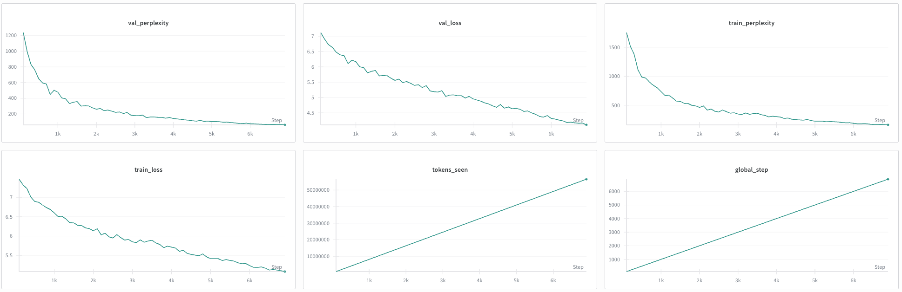

# Creating a Language Model from Scratch Report

# Runtime Hardware
Both architectures were trained and tested on RunPod resources with an A40 (48 GB VRAM). Some inferencing tests were also performed locally with an Apple M4 chip. Model logging was obtained by [Weights and Biases](https://wandb.ai/site/).

# Tokenizer 
In both scenarios, the tokenizer was taken from [speakleash/Bielik-4.5B-v3](https://huggingface.co/speakleash/Bielik-4.5B-v3) which actually was `LlamaTokenizerFast` and was used via the `AutoTokenizer` class from the `transformers` library. The vocabulary size was `32000`.

# Dataset
The dataset used was `plwiki`, retrieved via [speakleash](https://github.com/speakleash/speakleash). The entire dataset was not used; instead, 100k high-quality documents were selected. It was split into train, val, and test datasets with proportions 80/10/10.

# Training
Training was performed with the `Adam` optimizer with a learning rate of 0.0005 and weight decay of 0.1. After each 100 steps, there was a calculation of losses and perplexity on the train and validation datasets, and a model checkpoint was saved if a better validation loss value was obtained. If after 120 minutes training was not complete, it was stopped, saving a checkpoint and calculating losses on the test dataset. The batch size was 32.

# Transformer
The Transformer architecture was a decoder-only model based on the GPT-2 implementation with 134,367,744 parameters.
The model has a 256 context length with an embedding dimension of 768. There were
12 transformer blocks with 12 heads of multi-head self-attention in each block with layer normalization and residual connections. Each head of attention has a size of `768 / 12 = 64`.
For positional encoding, an `nn.Embedding` layer was used to learn this representation, not a sine/cosine-based positional encoding like in [Attention Is All You Need](https://arxiv.org/abs/1706.03762).

Model summary can be found in [outputs/transformer/model_summary.txt](outputs/transformer/model_summary.txt).

## Results
The following results were obtained after 120 minutes of training:

| Metric | Value |
|:---|:---|
| test_loss | 4.7306 |
| test_perplexity | 113.36 |
| tokens_seen | 56,532,992 |
| train_loss | 5.0819 |
| train_perplexity | 161.07 |
| val_loss | 4.1073 |
| val_perplexity | 60.78 |

Here are the learning curve plots:

Here are example model inferences with different temperatures.
Temperature was implemented by dividing logits by `T` before applying softmax.
In theory, with temperature < 1, results should be more concise because it is closer to argmax(logits). With temperature > 1, results should be more creative as we increase probabilities for smaller logits.

Below are truncated examples to demonstrate the model's capability to generate text.

| Temperature | Prompt | Truncated Generation |
| :--- | :--- | :--- |
| **0.5** | `"Polska to piękny kraj."` | `<s> Polska to piękny kraj. \nW Polsce, założona w 1988 roku, po raz pierwszy w 1992 roku.\nPo raz pierwszy w 1993 roku...` |
| **1.0** | `"Polska to piękny kraj."` | `<s> Polska to piękny kraj.\nCzotor.\nDwierciadły to były dwa małe klasy, służące na lewo do 2011 roku. Niektórzy jego...` |
| **1.5** | `"Polska to piękny kraj."` | `<s> Polska to piękny kraj.PA zabytka bydłarusowego modeli lotniczySwojewództwowenska Habsbursyjnej nr 168 jest rezygna...` |

*Note: Full generation results for all prompts and temperatures are available in [outputs/transformer/transformer_inference_results.json](outputs/transformer/transformer_inference_results.json)*

Transformer generation speed on M4: 13 tokens per second

Transformer generation on A40: 16.5 tokens per second

# RNN
The RNN model was created based on LSTM. The embedding dimension was 512, and the context length was 256. There were 10 LSTM layers with a hidden embedding dimension of 1024. The total number of parameters was 131,054,848.

The RNN saw more tokens during training and better utilized the GPU but obtained much worse results. I expected that the transformer would process more tokens during training. Perhaps there was some misconfiguration with the transformer training setup, but I'm not sure about those results.

## Results

The following results were obtained after 120 minutes of training:

RESULTS

Here are the learning curve plots:

CURVE PLOTS

Here are example model inferences with different temperatures.

Below are truncated examples to demonstrate the model's capability to generate text.

EXAMPLES

*Note: Full generation results for all prompts and temperatures are available in [outputs/rnn/rnn_inference_results.json](outputs/rnn/rnn_inference_results.json)*

RNN generation speed on M4: 4 tokens per second

RNN generation on A40: 16.5 tokens per second
