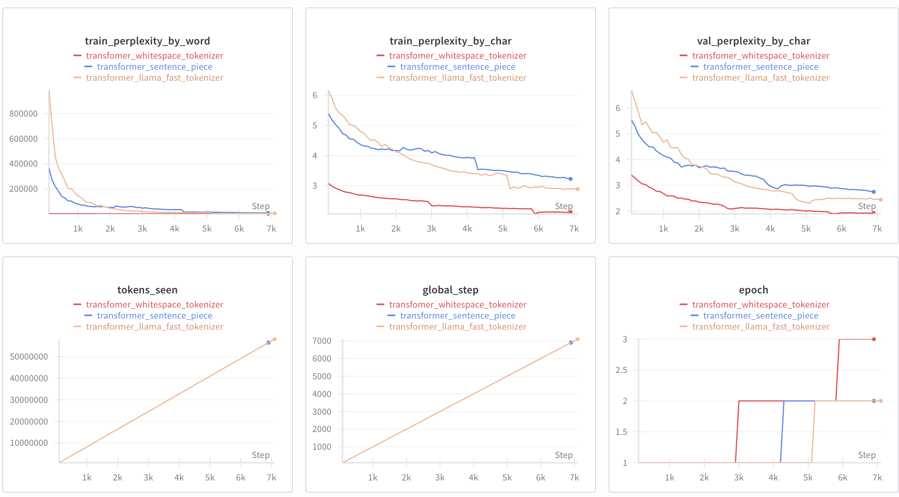
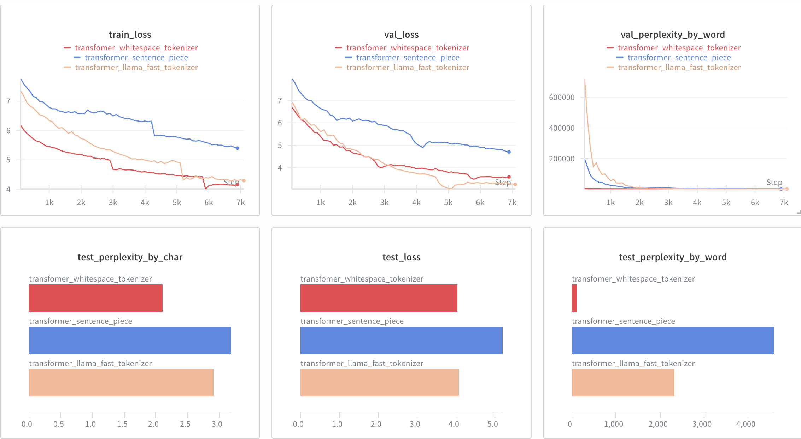

# Tokenization

# Runtime Hardware
3 transformer models were trained and tested on RunPod resources with an A40 (48 GB VRAM). Some inferencing tests were also performed locally with an Apple M4 chip. Model logging was obtained by [Weights and Biases](https://wandb.ai/site/).


# Dataset
The dataset used was `plwiki`, retrieved via [speakleash](https://github.com/speakleash/speakleash). The entire dataset was not used; instead, 100k high-quality documents were selected. It was split into train, val, and test datasets with proportions 80/10/10.

# Training
Training was performed with the `Adam` optimizer with a learning rate of 0.0005 and weight decay of 0.1. After each 100 steps, there was a calculation of losses and perplexity by character, token and word on the train and validation datasets, and a model checkpoint was saved if a better validation loss value was obtained. If after 120 minutes training was not complete, it was stopped, saving a checkpoint and calculating losses on the test dataset. The batch size was 32.

# Model architecture
The Transformer architecture was a decoder-only model based on the GPT-2 implementation with 134,367,744 parameters.
The model has a 256 context length with an embedding dimension of 768. There were
12 transformer blocks with 12 heads of multi-head self-attention in each block with layer normalization and residual connections. Each head of attention has a size of `768 / 12 = 64`.
For positional encoding, an `nn.Embedding` layer was used to learn this representation, not a sine/cosine-based positional encoding like in [Attention Is All You Need](https://arxiv.org/abs/1706.03762).

Model summary can be found in [outputs/transformer/model_summary.txt](outputs/transformer/model_summary.txt).

# Tokenizers
3 tokenizers were tested for model training:
- Pre-trained tokenizer: the tokenizer was taken from [speakleash/Bielik-4.5B-v3](https://huggingface.co/speakleash/Bielik-4.5B-v3) which actually was `LlamaTokenizerFast` which vocab size 32000 including special tokens
- Whitespace-based tokenizer (custom implementation): Custom tokenizer that tokenizes based on whitespace and punctuations
- SentencePiece tokenizer: SentencePiece trained with unigram model algorithm

Whitespace and SentencePiece tokenizers were trained on train part of plwiki dataset (80% from 100k high quality document)
Both tokenizers had a vocab size 32000 including special tokens. I mapped special tokens and their ids to the following format:
```
    unk_token -> <unk> id = 0
    bos_token -> <s> id = 1
    pad_token -> </s> id = 2
    eos_token -> <|im_end|> id = 4
```

In that way, those custom tokenizers have the same mapping for those 4 special tokens as `LlamaTokenizerFast`


# Results

## Losses and Perplexity Comparison
The following results were obtained after 120 minutes of training:

| Tokenizer | Metric | Train | Validation | Test |
|:---|:---|:---|:---|:---|
| **LlamaFastTokenizer** | loss | 4.2920 | 3.2565 | 4.0653 |
| | perplexity_by_char | 2.8844 | 2.4453 | 2.9055 |
| | perplexity_by_word | 2,947.59 | 597.54 | 2,323.72 |
| **SentencePiece** | loss | 5.4020 | 4.7075 | 5.1970 |
| | perplexity_by_char | 3.2231 | 2.7464 | 3.1895 |
| | perplexity_by_word | 7,378.40 | 1,360.64 | 4,590.96 |
| **WhiteSpaceTokenizer** | loss | 4.1588 | 3.5952 | 4.0364 |
| | perplexity_by_char | 2.1269 | 1.9299 | 2.1052 |
| | perplexity_by_word | 139.11 | 69.76 | 119.96 |


**Tokens seen during training:**
- LlamaFastTokenizer: 58,163,456
- SentencePiece: 56,525,568
- WhiteSpaceTokenizer: 56,526,848

Below you can find examples of generated sentences by each configuration:
- [LlamaFastTokenizer](outputs/tokenizers/transformer_llamatokenizer_inference_results.json)
- [SentencePiece](outputs/tokenizers/transformer_sentencepiece_inference_results.json)
- [WhiteSpaceTokenizer](outputs/tokenizers/transformer_whitespace_inference_results.json)

Here are the learning curve plots:







It seems that the whitespace tokenizer has the best perplexity values for both character and word aggregation. It is unclear whether perplexities can be compared across the 3 tokenizers. Based on https://sjmielke.com/comparing-perplexities.htm, it seems that we cannot compare perplexities between closed and open vocabulary tokenizers. In my case, the whitespace tokenizer is definitely closed vocabulary, but I'm not sure about `LlamaFastTokenizer` and SentencePiece. Theoretically, they use BPE/Unigram, so they can split unknown words into known parts by merging and do not produce OOV. Does this mean they are open vocabulary?

## OOV statistics
Here are OOV statistics for WhiteSpace tokenizer calculated on train, val and test dataset

| Split | Word Count | OOV Count | OOV Ratio |
|-------|-------------|-----------|-----------|
| Train | 32,843,516  | 5,057,255 | 15.40%    |
| Val   | 2,799,215   | 404,772   | 14.46%    |
| Test  | 4,252,360   | 696,593   | 16.38%    |

There is slightly more OOV percentage on test dataset than in train dataset but it's not a huge difference. 

## Tokenization Statistics 

Here can be found different tokenization statistics calculated across tokenizers.

| Tokenizer              | Tokens Count | Avg Tokens/Second | Speed Ratio |
|------------------------|--------------|-------------------|-------------|
| WhiteSpaceTokenizer        | 2,799,215    | 2,698,360         | 12.8x       |
| SentencePieceTokenizer | 3,650,154    | 1,296,400         | 6.1x        |
| LlamaTokenizerFast     | 4,515,875    | 211,187           | 1.0x        |

Statistics were obtained by loading the validation dataset, encoding it with all tokenizers 3 times, and calculating the mean from those runs. The WhiteSpace tokenizer is the fastest, because it doesn't have any mechanism for merging words and just takes tokens from the vocabulary.

Here are the results for average tokens per word. The statistics were calculated on the validation dataset (17 MB of text):

| Tokenizer              | Total Words | Total Tokens | Avg Tokens per Word |
|------------------------|-------------|--------------|---------------------|
| WhiteSpaceTokenizer    | 2,348,198   | 2,799,215    | 1.19                |
| SentencePieceTokenizer | 2,348,198   | 3,650,154    | 1.55                |
| LlamaTokenizerFast     | 2,348,198   | 4,515,875    | 1.92                |

The WhiteSpace tokenizer has the lowest number of tokens per word (1.19). This is reasonable because the intention was for each word to correspond to a single token. The value is not exactly 1 because the statistics were computed using Python's `split` function, so punctuation may have caused slight deviations.


## Qualitative Analysis

### Test Sentences

**Sentence 1:**  
"To jest przykładowy tekst do tokenizacji. Sprawdzimy, jak różne tokenizatory radzą sobie z tym zdaniem. Polska literatura oferuje wiele interesujących dzieł, które warto przeczytać. Czytanie książek rozwija wyobraźnię i poszerza horyzonty myślowe."

**Sentence 2:**  
"Tokenizacja jest kluczowym krokiem w przetwarzaniu języka naturalnego. Różne podejścia mogą prowadzić do różnych wyników. Algorytmy uczenia maszynowego wymagają odpowiedniego przygotowania danych wejściowych. Właściwe przetwarzanie tekstu wpływa na jakość modeli sztucznej inteligencji."

**Sentence 3:**  
"W dzisiejszych czasach modele językowe stają się coraz bardziej zaawansowane, a tokenizacja odgrywa ważną rolę w ich skuteczności. Nowoczesne technologie przekształcają sposób, w jaki komunikujemy się i przetwarzamy informacje. Rozwój sztucznej inteligencji otwiera nowe możliwości w wielu dziedzinach nauki."

### Metrics for Individual Sentences

| Tokenizer | Sentence | Token Count | Word Count | Tokens/Word | Direct Encoding (%) |
|-----------|----------|-------------|------------|-------------|---------------------|
| **WhiteSpace** | 1 | 38 | 32 | 1.19 | 59.38% |
| **WhiteSpace** | 2 | 36 | 32 | 1.13 | 71.88% |
| **WhiteSpace** | 3 | 44 | 39 | 1.13 | 74.36% |
| **SentencePiece** | 1 | 55 | 32 | 1.72 | 59.38% |
| **SentencePiece** | 2 | 49 | 32 | 1.53 | 59.38% |
| **SentencePiece** | 3 | 54 | 39 | 1.38 | 66.67% |
| **LlamaFast** | 1 | 50 | 32 | 1.56 | 65.63% |
| **LlamaFast** | 2 | 45 | 32 | 1.41 | 71.88% |
| **LlamaFast** | 3 | 53 | 39 | 1.36 | 71.79% |

### Token Representations

#### Sentence 1 Tokenization

**WhiteSpace:**
```
["To", "jest", "<unk>", "tekst", "do", "<unk>", ".", "<unk>", ",", "jak", "różne", "<unk>", "<unk>", "sobie", "z", "tym", "zdaniem", ".", "Polska", "literatura", "oferuje", "wiele", "interesujących", "dzieł", ",", "które", "warto", "przeczytać", ".", "<unk>", "książek", "rozwija", "<unk>", "i", "<unk>", "<unk>", "<unk>", "."]
```

**SentencePiece:**
```
["To", "jest", "przykład", "owy", "tekst", "do", "to", "ken", "izacji", ".", "Spraw", "dzi", "my", ",", "jak", "różne", "to", "ken", "iz", "atory", "rad", "zą", "sobie", "z", "tym", "zdaniem", ".", "Polska", "literatura", "oferuje", "wiele", "interesując", "ych", "dzieł", ",", "które", "warto", "prze", "czyt", "ać", ".", "Czy", "ta", "nie", "książek", "rozwija", "wyobraźni", "ę", "i", "poszerza", "horyzont", "y", "myśl", "owe", "."]
```

**LlamaFast:**
```
["▁To", "▁jest", "▁przykład", "owy", "▁tekst", "▁do", "▁to", "ke", "nizacji", ".", "▁Spraw", "dzimy", ",", "▁jak", "▁różne", "▁to", "ke", "niz", "atory", "▁radzą", "▁sobie", "▁z", "▁tym", "▁zdaniem", ".", "▁Polska", "▁literatura", "▁oferuje", "▁wiele", "▁interesujących", "▁dzieł", ",", "▁które", "▁warto", "▁przeczytać", ".", "▁Czy", "tanie", "▁książek", "▁rozwija", "▁wyobraźnię", "▁i", "▁posze", "rza", "▁horyzon", "ty", "▁myśl", "owe", "."]
```

#### Sentence 2 Tokenization

**WhiteSpace:**
```
["<unk>", "jest", "kluczowym", "krokiem", "w", "<unk>", "języka", "naturalnego", ".", "Różne", "podejścia", "mogą", "prowadzić", "do", "różnych", "wyników", ".", "<unk>", "uczenia", "maszynowego", "wymagają", "odpowiedniego", "przygotowania", "danych", "<unk>", ".", "<unk>", "<unk>", "tekstu", "wpływa", "na", "jakość", "modeli", "sztucznej", "inteligencji", "."]
```

**SentencePiece:**
```
["To", "ken", "izacja", "jest", "klucz", "owym", "krokiem", "w", "przetwarza", "niu", "języka", "naturalnego", ".", "Róż", "ne", "podejścia", "mogą", "prowadzić", "do", "różnych", "wyników", ".", "Algorytm", "y", "uczeni", "a", "maszynowego", "wymagają", "odpowiedniego", "przygotowania", "danych", "wejściowy", "ch", ".", "W", "ła", "ści", "we", "przetwarza", "nie", "tekstu", "wpływa", "na", "jakość", "modeli", "sztuczn", "ej", "inteligencji", "."]
```

**LlamaFast:**
```
["▁To", "ke", "nizacja", "▁jest", "▁kluczowym", "▁krokiem", "▁w", "▁przetwarza", "niu", "▁języka", "▁naturalnego", ".", "▁Różne", "▁podejścia", "▁mogą", "▁prowadzić", "▁do", "▁różnych", "▁wyników", ".", "▁Al", "goryt", "my", "▁uczenia", "▁maszyn", "owego", "▁wymagają", "▁odpowiedniego", "▁przygotowania", "▁danych", "▁wejści", "owych", ".", "▁Właści", "we", "▁przetwarzanie", "▁tekstu", "▁wpływa", "▁na", "▁jakość", "▁modeli", "▁sztucznej", "▁inteligencji", "."]
```

#### Sentence 3 Tokenization

**WhiteSpace:**
```
["W", "dzisiejszych", "czasach", "modele", "językowe", "stają", "się", "coraz", "bardziej", "zaawansowane", ",", "a", "<unk>", "odgrywa", "ważną", "rolę", "w", "ich", "skuteczności", ".", "<unk>", "technologie", "<unk>", "sposób", ",", "w", "jaki", "<unk>", "się", "i", "<unk>", "informacje", ".", "Rozwój", "sztucznej", "inteligencji", "otwiera", "nowe", "możliwości", "w", "wielu", "dziedzinach", "nauki", "."]
```

**SentencePiece:**
```
["W", "dzisiejszych", "czasach", "modele", "język", "owe", "stają", "się", "coraz", "bardziej", "zaawansowane", ",", "a", "to", "ken", "izacja", "odgrywa", "ważną", "rolę", "w", "ich", "skuteczności", ".", "Nowo", "czesne", "technolog", "ie", "przekształca", "ją", "sposób", ",", "w", "jaki", "komuni", "k", "ujemy", "się", "i", "przetwarza", "my", "informacje", ".", "Rozwój", "sztuczn", "ej", "inteligencji", "otwiera", "nowe", "możliwości", "w", "wielu", "dziedzinach", "nauki", "."]
```

**LlamaFast:**
```
["▁W", "▁dzisiejszych", "▁czasach", "▁modele", "▁języ", "kowe", "▁stają", "▁się", "▁coraz", "▁bardziej", "▁zaawansowane", ",", "▁a", "▁to", "ke", "nizacja", "▁odgrywa", "▁ważną", "▁rolę", "▁w", "▁ich", "▁skuteczności", ".", "▁Nowoczes", "ne", "▁technologie", "▁przekształ", "cają", "▁sposób", ",", "▁w", "▁jaki", "▁komu", "niku", "jemy", "▁się", "▁i", "▁przetwarza", "my", "▁informacje", ".", "▁Rozwój", "▁sztucznej", "▁inteligencji", "▁otwiera", "▁nowe", "▁możliwości", "▁w", "▁wielu", "▁dziedzinach", "▁nauki", "."]
```

### Average Metrics per Tokenizer

| Tokenizer | Avg. Tokens/Word | Avg. Direct Encoding (%) |
|-----------|------------------|--------------------------|
| **WhiteSpace** | 1.14 | 68.54% |
| **SentencePiece** | 1.53 | 61.81% |
| **LlamaFast** | 1.43 | 69.77% |

### Observations

- **WhiteSpace Tokenizer** achieves the lowest average tokens-per-word ratio (1.14), indicating the most efficient text compression.
- **LlamaFast Tokenizer** has the highest percentage of directly encoded words (69.77%), suggesting the best vocabulary alignment with the test text.
- **WhiteSpace Tokenizer** also performs well in direct encoding (68.54%), despite using `<unk>` tokens for out-of-vocabulary words.
- **SentencePiece** generates the most tokens (1.53 tokens/word) and has the lowest direct encoding rate (61.81%), frequently splitting words into subword units (e.g., "przykładowy" → "przykład", "owy").
- **WhiteSpace** uses `<unk>` tokens for out-of-vocabulary words, while **SentencePiece** and **LlamaFast** split unknown words into known subword pieces.
- **LlamaFast** uses the "▁" symbol to mark word boundaries, offering a balance between efficiency (1.43 tokens/word) and direct encoding capability.