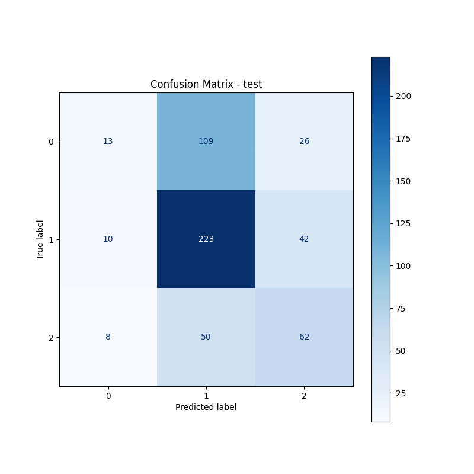
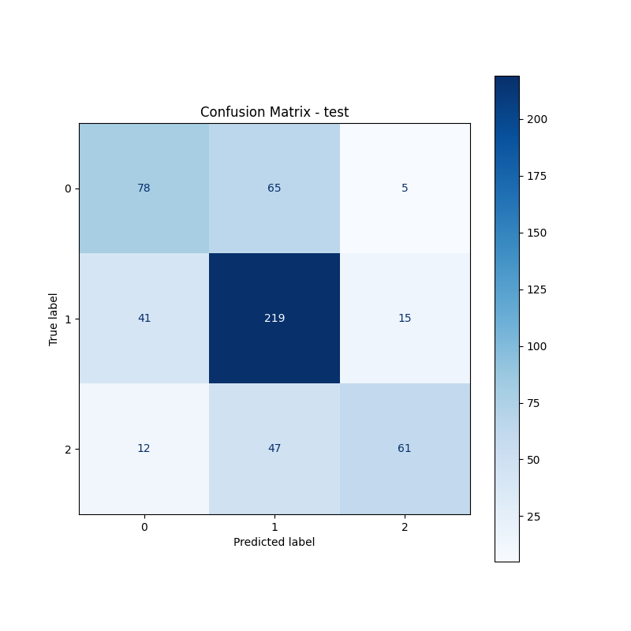

# Fine-Tuning vs. From-Scratch Training for Text Classification

## Introduction
The goal of this assignment was to compare two approaches to training decoder-only language models for full-text classification:
- From-scratch training
- Fine-tuning a pre-trained model

The chosen dataset was [polish_youth_slang_classification](https://huggingface.co/datasets/jziebura/polish_youth_slang_classification). For from-scratch training, I used a GPT-2 like architecture based on the implementation from lab01 and lab02. The parameter setup was downscaled appropriately to achieve approximately 5 million parameters. For fine-tuning, I used [Bielik-1.5B-v3](https://huggingface.co/speakleash/Bielik-1.5B-v3). For both models, I used the `speakleash/Bielik-1.5B-v3` tokenizer with a vocab size of `32000`. Training loops were created in PyTorch and can be found in [classifier_train.py](classifier_train.py). Code for models can be found in [transformer_based_llm.py](transformer_based_llm.py) where:
- `GPTModelSequenceClassifier` - Model for from-scratch training
- `CustomDecoderClassifier` - Model for fine-tuning

## Dataset
The dataset contains Polish youth slang phrases for sentiment classification. There are 3 sentiments in this dataset: `0 - Negative sentiment`, `1 - Neutral or ambiguous sentiment`, and `2 - Positive sentiment`. The dataset was split into train/val/test portions with an 80/10/10 ratio, which gave 4337/542/543 rows per split. The dataset is unbalanced, as can be seen in the table below.

| Dataset | Label 0 | Label 1 | Label 2 |
|---------|---------|---------|---------|
| Train   | 29.03%  | 51.16%  | 19.81%  |
| Val     | 28.60%  | 50.37%  | 21.03%  |
| Test    | 27.26%  | 50.64%  | 22.10%  |

*Table 1: Distribution of labels across train, validation and test datasets*

No methods like stratified splitting were applied as the splits were provided by the dataset author.

In terms of preprocessing, I found that some sentences had trailing whitespaces, so I decided to remove them using Python's `.strip()` method, which decreased the average text length by 10 characters.

*Figure 1: Text length distribution in train dataset*

Text length distributions look similar for all splits, so I included only the training split. The average text length (after stripping) was 79 and the median was 66. In my solution, if a tokenized text was longer than 256 tokens, it was truncated to 256 tokens. I checked the token representation after tokenizing the dataset and it seemed that the maximum tokens per text was `216`, so basically no texts were truncated. My solution supported both truncation and padding, so each text after tokenization had a length of 256 tokens.

## From-Scratch Training Configuration
A GPT-2 like architecture was used followed by a classification head with 2 dense layers with GELU and Dropout between them. For the classification head, the representation of the last token in the sentence that was not a padding token was used.

The exact configuration can be found in the table below:

| Parameter       | Value |
|-----------------|-------|
| emb_dim         | 128   |
| n_heads         | 4     |
| n_layers        | 8     |
| drop_rate       | 0.4   |
| context_length  | 256   |

*Table 2: GPT-2 model configuration for from-scratch training*

That configuration gave `5,728,003` parameters and all of them were trainable as it was a from-scratch approach.

Dataset was tokenized with `speakleash/Bielik-1.5B-v3` tokenizer including truncation and padding to `256` characters. Initially I tested a ~10 million parameter model but it overfitted fast, so I decided to use a smaller model with stronger regularization.

| Parameter             | Value   |
|-----------------------|---------|
| optimizer             | adamw   |
| batch_size            | 32      |
| weight_decay          | 0.35    |
| gradient_clip         | 1       |
| learning_rate         | 0.00001 |
| num_epochs            | 140     |
| max_training_minutes  | 90      |

*Table 3: From-scratch training configuration*

If training took longer than `max_training_minutes`, it was stopped even if not all epochs were done. Additionally, `CosineAnnealingLR` was used to schedule learning rate through iterations. Scheduler step was done after each epoch. Training took approximately 80 minutes locally on `M4` chip.

Model summary can be found [here](outputs/lab03/gpt2/model_summary.txt).

## Fine-Tuning Training Configuration
For fine-tuning I used [Bielik-1.5B-v3](https://huggingface.co/speakleash/Bielik-1.5B-v3) model followed by a classification head with 2 dense layers with GELU and Dropout between them. So it's similar to the previous approach but the difference is that this classifier head had a bigger latent space as `hidden_size` in Bielik was 1536 and 128 in from-scratch training. Again, for the classification head, the representation of the last token in the sentence that was not a padding token was picked. As this model had `1,548,145,155` parameters, it would be computationally expensive to train all parameters, so some fine-tuning technique should be used. I decided to freeze all Bielik layers except the last 3 transformer layers. After that operation, from `1,548,145,155` parameters only `141,247,491` remained trainable, which significantly decreased computational complexity.

| Parameter            | Value  |
|----------------------|--------|
| optimizer            | adamw  |
| batch_size           | 32     |
| num_epochs           | 3      |
| vocab_size           | 32000  |
| weight_decay         | 0.35   |
| gradient_clip        | 1      |
| learning_rate        | 0.00001|
| context_length       | 256    |
| max_training_minutes | 30     |

*Table 4: Training configuration for fine-tuning*

Same training loop, tokenization, and preprocessing steps as in the previous example were applied. This time for training I used an `A40` GPU instance in RunPod. I trained 3 epochs and it took around 15 minutes.

Model summary can be found [here](outputs/lab03/bielik/model_summary.txt).

## Results
In this section I will present results that I obtained with both approaches.

### From-Scratch Training
Results can be found in the table below.

| Dataset | Accuracy | F1 Score (Macro) | Loss   | MCC    |
|---------|----------|------------------|--------|--------|
| Train   | 0.5607   | 0.4484           | 0.9105 | 0.2660 |
| Val     | 0.5258   | 0.4185           | 0.9757 | 0.2083 |
| Test    | 0.5488   | 0.4400           | 0.9656 | 0.2362 |

*Table 5: From-scratch training results*

*Figure 2: Confusion matrix for from-scratch training on test dataset*

*Figure 3: Learning curves for from-scratch training*

For comparison, I've also included plots of the first model that I trained, which had approximately 10 million parameters. In that run, I didn't use `CosineAnnealingLR`, gradient clipping, and I used smaller dropout and weight decay for the `AdamW` optimizer. The bigger model without those additional features overfitted.

### Fine-Tuning Training
Results can be found in the table below.

| Dataset | Accuracy | F1 Score (Macro) | Loss   | MCC    |
|---------|----------|------------------|--------|--------|
| Train   | 0.8869   | 0.8785           | 0.3721 | 0.8124 |
| Val     | 0.6808   | 0.6513           | 0.7350 | 0.4692 |
| Test    | 0.6593   | 0.6296           | 0.7768 | 0.4320 |

*Table 6: Fine-tuning results*

*Figure 4: Confusion matrix for fine-tuning training on test dataset*

*Figure 5: Learning curves for fine-tuning training*

Learning curves for that configuration are not interesting at all. It was a short ~15 minute training for 3 epochs, and the curves just go up or down depending on their type. But that's a characteristic of fine-tuning. It should be short training where we rapidly see results.

Comparing both approaches, the fine-tuning approach obtained much better results than from-scratch training: `0.6593` vs `0.5488` Accuracy, `0.6296` vs `0.4400` F1-Score (macro), and `0.4320` vs `0.2362` MCC measured on the test dataset. These results were expected from this study. I believe that fine-tuning performs better as the pre-training phase was performed on the backbone model, and that model already has meaningful token representations which can be slightly modified and used by the classification head, while during training from scratch we have to learn those representations from scratch as well. When performing both approaches, we have to be careful about overfitting, especially with small dataset sizes. We should consider regularization approaches like dropout, weight decay, and other tricks like gradient clipping or learning rate schedulers.

### Inference Time
For comparing inference time, I tested inference time on one data minibatch that contained 100 examples. I decreased it from 1000 proposed in the description, as I performed it locally on `M4` chip and I expected that inference on fine-tuned Bielik would take a lot of time.

- From-scratch model - Inference time: 0.5 second per 100 examples
- Fine-tuning model - Inference time: 80 seconds per 100 examples

Fine-tuned Bielik took ~160 times more time on inference which was expected as this model had ~270 times more parameters than the from-scratch trained decoder-based classifier.