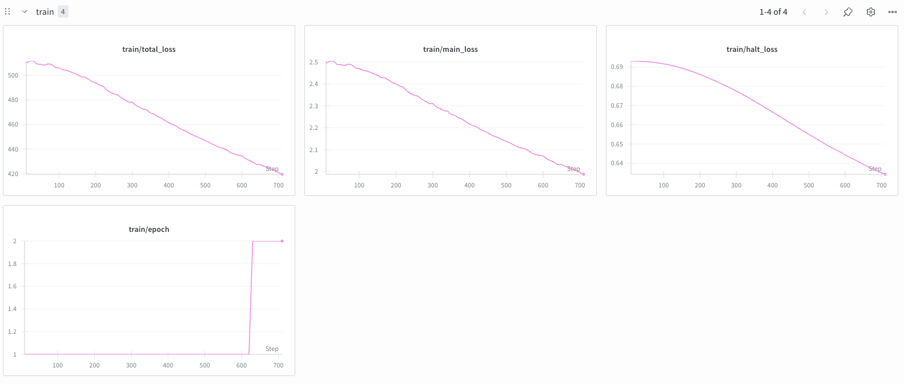
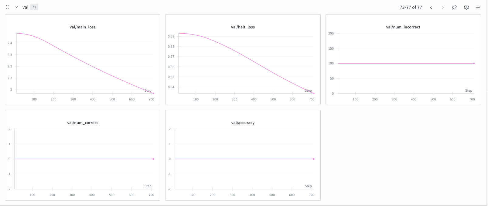
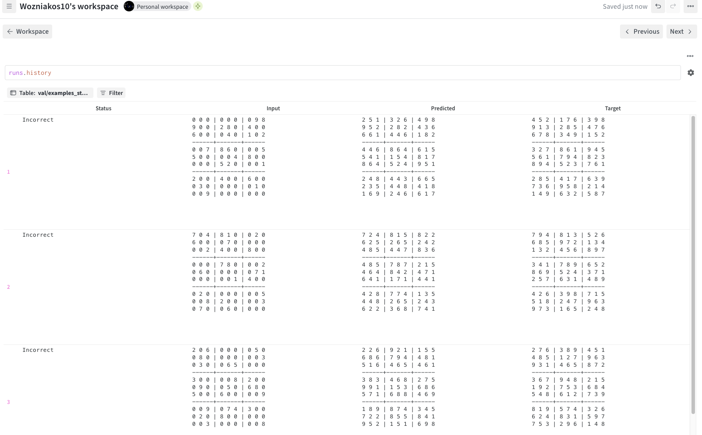

# Reasoning with Language Models: Sudoku Puzzle Solving

## Introduction
The objective of this exercise was to explore reasoning capabilities of different model types on the task of solving Sudoku puzzles. Two approaches were compared:
- **TRM (Tiny Recursive Model)** - A compact recursive neural network architecture designed for iterative reasoning
- **LLM (Large Language Model)** - Various large language models using different prompting strategies

The task involves receiving an incomplete 9×9 Sudoku grid (represented as a flattened list of 81 integers where 0 indicates an empty cell) and producing the completed solution following standard Sudoku rules.

## Runtime Hardware
TRM training was executed on RunPod resources with an A40 GPU (48 GB VRAM) for approximately 3 hours. LLM evaluation was performed using cloud API services (OpenAI GPT-4, Anthropic Claude, Google Gemini, and local Ollama models).

## Dataset
The dataset used was [sapientinc/sudoku-extreme](https://huggingface.co/datasets/sapientinc/sudoku-extreme) from Hugging Face, containing challenging Sudoku puzzles with solutions.

| Split | Size | Description |
|-------|------|-------------|
| Train | 100,000 | Used for TRM training (from train split, indices 0-100k)  |
| Validation | 1,000 | Used for TRM validation during training (from train split, indices 100k-101k) |
| Test | 423,000 | Entire test split used for TRM evaluation |

For LLM evaluation, 5 data points were selected from the test dataset (indices: 0, 10, 20, 30, 40) for detailed analysis due to API costs and time constraints. TRM was also evaluated on these same 5 samples for direct comparison.

## TRM Training

### Library
For simplicity, the [tiny-recursive-model](https://github.com/lucidrains/tiny-recursive-model) library by lucidrains was used. This library provides a clean implementation of the Tiny Recursive Model architecture, which uses iterative refinement with learned halting to solve reasoning tasks.

The model configuration used in this experiment has approximately **2.4M parameters**. This is a reduced configuration compared to the paper's best results, which used a TRM-MLP with 5M parameters trained on 1M examples. Due to computational constraints, I used a smaller model (2.4M vs 5M parameters) and less training data (100k vs 1M examples).

### Model Configuration

| Parameter | Value |
|-----------|-------|
| Dimension | 512 |
| Depth | 4 |
| Sequence Length | 81 (9×9 grid) |
| Number of Tokens | 10 (digits 0-9) |
| Network Architecture | MLP |
| Num Refinement Blocks (H_cycles) | 3 |
| Num Latent Refinements (L_cycles) | 6 |

*Table 1: TRM model configuration*

> **NOTE**
> **Why MLP instead of attention-based architectures?**  
> As noted in the original paper, MLP was selected over attention-based architectures because it demonstrated superior performance on tasks with small context windows, such as the 9x9 Sudoku grid.

### Training Configuration

| Parameter | Value |
|-----------|-------|
| Optimizer | Adam (via Trainer) |
| Batch Size | 160 |
| Epochs | 20 |
| Max Training Time | 240 minutes |
| Device | CUDA (A40) |

*Table 2: TRM training configuration*

Training was performed with the custom `WandBTrainer` that extends the base Trainer from the tiny-recursive-model library. Validation was performed periodically during training on 100 samples. The best model checkpoint was saved based on validation accuracy.

### Learning Curves



*Figure 1: Training loss curves during TRM training*



*Figure 2: Validation metrics during TRM training*

### TRM Results

| Metric | Value | Evaluated On |
|--------|-------|-------------|
| Exact Accuracy | 0.0% | Full test set (423k samples) |
| Partial Accuracy | ~35.3% | 5 samples (same as LLM evaluation) |

*Table 3: TRM evaluation results*

Unfortunately, the TRM model achieved **0% exact accuracy** on the full Sudoku test set (423k puzzles), meaning it was unable to completely solve any puzzle correctly. The **partial accuracy of ~35.3%** was calculated on the same 5 test samples used for LLM evaluation (for direct comparison), indicating that the model learned to fill in approximately one-third of the cells correctly on average.

> **NOTE**
> Partial accuracy was not tracked during the full test set evaluation. Reproducing this metric on the complete 423k test split is not feasible as GPU access is no longer available, and CPU inference would require prohibitively long computation time.

### TRM Prediction Examples



*Figure 3: Examples of TRM predictions showing puzzle input, model prediction, and expected solution*

The examples reveal that while TRM can identify some correct values, it struggles with the complex constraint satisfaction required for Sudoku. The model tends to produce solutions that violate Sudoku rules (duplicate numbers in rows, columns, or 3×3 boxes).

---

## LLM Evaluation

### Methodology
Large Language Models were evaluated using the same Sudoku puzzles as TRM. The evaluation leveraged the LangChain framework for structured LLM interactions.

### Prompting Strategies
Two prompting strategies were tested:

1. **Zero-Shot Prompting**: The model receives only the task description and puzzle without examples
2. **Few-Shot Prompting**: The model receives the task description along with 5 solved example puzzles

### Sudoku Grid Representation
The Sudoku grid is passed to the LLM as a flattened list of 81 integers, row by row from top-left to bottom-right:
```
[0, 9, 0, 0, 0, 1, 2, 0, 0, 0, 3, 0, 0, 2, 8, 4, 0, 6, ...]
```
Where `0` indicates an empty cell that needs to be filled.

### System Prompt
```
You are a highly intelligent AI specialized in solving Sudoku puzzles. Your task is to fill in the missing numbers in a 9x9 Sudoku grid according to the game's rules. 
The grid is represented as a flattened 9x9 list of 81 integers (0-9), row by row from top-left to bottom-right. '0' indicates an empty cell. Return only the completed grid in the same format, do not include any explanations or additional text.
```

### Models Tested
- **Gemini 2.5 Flash** - Google's flash model 
- **Qwen3 14B** - Local model via Ollama
- **GPT-OSS 120B** - Via OpenRouter
- **Claude Opus 4.5** - Anthropic's flagship model

### Evaluation Metrics
Two metrics were used for evaluation:

1. **Exact Accuracy**: Binary metric - whether the puzzle was solved completely correctly (all 81 cells match)
2. **Partial Accuracy**: Fraction of correct cells out of 81, providing a more nuanced view of model performance even when puzzles aren't fully solved

---

## LLM Evaluation Results

### Results Summary

| Model | Strategy | Exact Accuracy | Partial Accuracy |
|-------|----------|----------------|------------------|
| **Claude Opus 4.5** | Zero-Shot | 0% | 55.6% |
| **Claude Opus 4.5** | Few-Shot | 0% | 61.5% |
| **Gemini 2.5 Flash** | Zero-Shot | 0% | 53.1% |
| **Gemini 2.5 Flash** | Few-Shot | 0% | 48.9% |
| **GPT-OSS 120B** | Zero-Shot | 0% | 10.9% |
| **GPT-OSS 120B** | Few-Shot | 0% | 11.1% |

*Table 4: LLM evaluation results on 5 test samples*

> **NOTE**
> Qwen3 14B was tested locally via Ollama but could not produce valid results. The model struggled with returning structured output as a list of 81 integers. Simpler structured output tasks worked correctly, suggesting the complexity of the output format was the issue rather than the model's reasoning capabilities.

### Key Observations

1. **No Model Achieved Exact Accuracy**: All LLMs failed to completely solve any of the 5 test puzzles, indicating the extreme difficulty of this Sudoku dataset.

2. **Claude Opus 4.5 Performed Best**: Achieved the highest partial accuracy (55.6-61.5%), correctly filling over half of the cells on average. Few-shot prompting improved performance.

3. **Gemini 2.5 Flash Comparable**: Showed similar performance to Claude Opus zero-shot (~49-53% partial accuracy).

4. **GPT-OSS 120B Struggled**: Performed significantly worse (~11% partial accuracy), likely due to output token limits causing incomplete responses.

5. **Prompting Strategy Impact Varied**: Few-shot prompting helped Claude Opus (+6%) but slightly hurt Gemini (-4%), suggesting model-dependent benefits.

---

## TRM vs LLM Comparison

| Model | Strategy | Exact Accuracy | Partial Accuracy |
|-------|----------|----------------|------------------|
| **TRM** | N/A | 0.0% | 35.3% |
| **Claude Opus 4.5** | Zero-Shot | 0.0% | 55.6% |
| **Claude Opus 4.5** | Few-Shot | 0.0% | 61.5% |
| **Gemini 2.5 Flash** | Zero-Shot | 0.0% | 53.1% |
| **Gemini 2.5 Flash** | Few-Shot | 0.0% | 48.9% |
| **GPT-OSS 120B** | Zero-Shot | 0.0% | 10.9% |
| **GPT-OSS 120B** | Few-Shot | 0.0% | 11.1% |

*Table 5: Comparison of TRM and LLM results on 5 test samples*


---

## Conclusions

### TRM Observations
1. **Limited Success**: Despite training on 100k examples for approximately 3 hours on A40 GPU, TRM achieved 0% exact accuracy on Sudoku solving
2. **Partial Learning**: The ~35% partial accuracy suggests the model learned some patterns but cannot satisfy the full constraint structure of Sudoku

### LLM Observations
1. **Better Than TRM But Still Insufficient**: The best LLMs (Claude Opus 4.5, Gemini 2.5 Flash) achieved ~55-62% partial accuracy, outperforming TRM's 35%, but still failed to fully solve any puzzle
2. **Model Quality Matters**: There was a significant performance gap between stronger models (Claude, Gemini ~50-60%) and weaker ones (GPT-OSS 120B ~11%)
3. **Prompting Had Limited Effect**: Both zero-shot and few-shot strategies produced similar results, suggesting that format understanding is not the bottleneck
4. **Input Format Limitation**: This evaluation only tested the flattened list-of-integers format. Presenting Sudoku puzzles in alternative formats (e.g., visual grid representation, row-by-row text format) might yield different results and could be explored in future work


### Final Takeaways
1. **Reproducibility Constraints**: I was unable to reproduce the results from the original technical report (which reported 87.4% exact accuracy) due to limited compute resources. My reduced model (~2.4M parameters vs 5M) and smaller dataset (100k vs 1M examples) likely significantly impacted performance.
2. **LLM Limitations on Extreme Puzzles**: Contrary to expectations, even SOTA LLMs failed to fully solve these "extreme" difficulty puzzles, despite their strong reasoning capabilities.
3. **Potential of Alternative Inputs**: Exploring different input representations (e.g., 2D grid text format vs flattened list) could be a key area for future research to potentially improve LLM performance on this task.
4. **Sudoku as a Benchmark**: Sudoku remains a highly challenging benchmark for both compact neural networks and large language models, particularly when computational resources or input flexibility are constrained.

